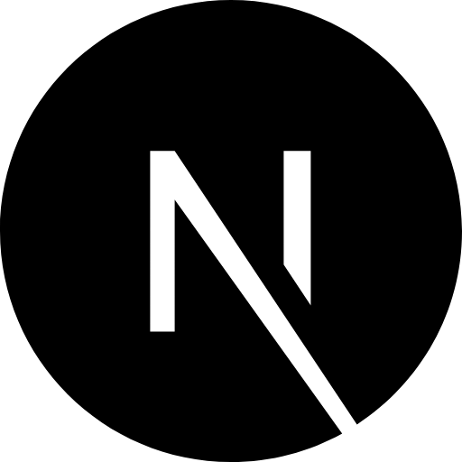

 Hi there! I'm Lokaesshwar! 👋

  
  
  

I'm **`Lokaesshwar`** a Computer Science Engineering student from VIT-BHOPAL ,
and a self-taught developer with deep passion for Computer-Science and Technologies.

 <!---

- 👀 Looking to collaborate on **open-source projects**, currently contributing to **GSoC organizations**
- 📜 I work with **React** projects.
- 💬 Either ask me about **Biology** or **JS** 😊
- 🐧 Linux Enthusiast & FOSS supporter.
- 📫 How to reach me **lokaesshwar@gmail.com**
<!--- - 👨‍💻 All of my projects are available at [https://lokaesshwar-portfolio.vercel.app/) -->
<!---

**Languages and Tools:**  

<code></code>
<code></code>
<code></code>
<code></code>
<code></code>
<code></code>
<code></code>
<code></code>
<code></code>
<code></code>
<code></code>
<code></code>
<code></code>

## Badges

  <table>
    <tr>
      <td align="center">
        
         
        <a href="https://drive.google.com/file/d/1lzuXRsfERvwxEknN0CIUKDle3WSHCmBx/view?usp=sharing" target="_blank" rel="noopener noreferrer">Postman API Fundamentals</a>
      </td>
      <td align="center">
        
         
        <a href="https://www.credly.com/badges/1e53dcd3-b994-4836-989b-ab5fd9e44624/public_url" target="_blank" rel="noopener noreferrer">AWS-Introduction to Cloud 101</a>
      </td>
      <td align="center">
        
         
        Leetcode 100 days Badge
      </td>
    </tr>
    <tr>
      <td align="center">
        
         
        Contributor SSOC
      </td>
      <td align="center">
        
         
        GSSOC - Contributor
      </td>
      <td align="center">
        
         
        Good First Issue - Contributor
      </td>
    </tr>
  </table>

-----

📈 My GitHub Stats

  
  
   
  
   
  

